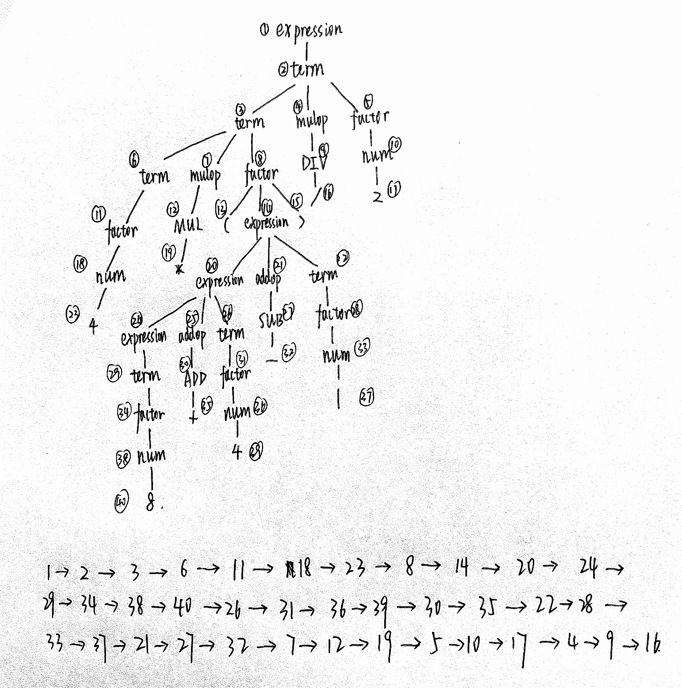

# lab2 实验报告

PB20000137 李远航

## 问题1: getelementptr
请给出 `IR.md` 中提到的两种 getelementptr 用法的区别,并稍加解释:
  - `%2 = getelementptr [10 x i32], [10 x i32]* %1, i32 0, i32 %0`
  - `%2 = getelementptr i32, i32* %1 i32 %0`

第一种指针类型是`[10 x i32]*`，后面的0是指指向`[10 x i32][0]`，然后偏移量为`%0`，我认为可以理解成二维数组

第二种指针类型是`i32*`，直接是一个`%0`的偏移

## 问题2: cpp 与 .ll 的对应

请说明你的 cpp 代码片段和 .ll 的每个 BasicBlock 的对应关系。

- assign

    ```c++
    #include "BasicBlock.h"
    #include "Constant.h"
    #include "Function.h"
    #include "IRBuilder.h"
    #include "Module.h"
    #include "Type.h"
    
    #include <iostream>
    #include <memory>
    
    #ifdef DEBUG                                             // 用于调试信息,大家可以在编译过程中通过" -DDEBUG"来开启这一选项
    #define DEBUG_OUTPUT std::cout << __LINE__ << std::endl; // 输出行号的简单示例
    #else
    #define DEBUG_OUTPUT
    #endif
    
    #define CONST_INT(num) ConstantInt::get(num, module)
    
    #define CONST_FP(num) ConstantFP::get(num, module) // 得到常数值的表示,方便后面多次用到
    
    int main()
    {
        auto module = new Module("Cminus code"); // module name是什么无关紧要
        auto builder = new IRBuilder(nullptr, module);
        Type *Int32Type = Type::get_int32_type(module);
    
        auto mainFun = Function::create(FunctionType::get(Int32Type, {}),
                                        "main", module);
        auto bb = BasicBlock::create(module, "entry", mainFun);
        // BasicBlock的名字在生成中无所谓,但是可以方便阅读
        builder->set_insert_point(bb);
    
        auto retAlloca = builder->create_alloca(Int32Type);
        builder->create_store(CONST_INT(0), retAlloca); // 默认 ret 0
        // int a[10];
        auto *arrayType = ArrayType::get(Int32Type, 10);
        auto aAlloca = builder->create_alloca(arrayType);
    
        // a[0] = 10;
        auto a0GEP = builder->create_gep(aAlloca, {CONST_INT(0), CONST_INT(0)});
        builder->create_store(CONST_INT(10), a0GEP);
    
        // a[1] = a[0] * 2
        auto a1GEP = builder->create_gep(aAlloca, {CONST_INT(0), CONST_INT(1)});
        a0GEP = builder->create_gep(aAlloca, {CONST_INT(0), CONST_INT(0)});
        auto a0Load = builder->create_load(a0GEP);
        auto mul = builder->create_imul(a0Load, CONST_INT(2)); // a[0] * 2
        builder->create_store(mul, a1GEP);
    
        // return a[1];
        builder->create_store(mul, retAlloca);
        auto retLoad = builder->create_load(retAlloca);
        builder->create_ret(retLoad);
    
        std::cout << module->print();
        delete module;
        return 0;
    }
    ```

    ```assembly
    define i32 @main() {
    label_entry:
      %op0 = alloca i32
      store i32 0, i32* %op0
      %op1 = alloca [10 x i32]
      %op2 = getelementptr [10 x i32], [10 x i32]* %op1, i32 0, i32 0
      store i32 10, i32* %op2
      %op3 = getelementptr [10 x i32], [10 x i32]* %op1, i32 0, i32 1
      %op4 = getelementptr [10 x i32], [10 x i32]* %op1, i32 0, i32 0
      %op5 = load i32, i32* %op4
      %op6 = mul i32 %op5, 2
      store i32 %op6, i32* %op3
      store i32 %op6, i32* %op0
      %op7 = load i32, i32* %op0
      ret i32 %op7
    }
    ```

    `auto bb = BasicBlock::create(module, "entry", mainFun);`对应`label_entry`

- fun

    ```c++
    #include "BasicBlock.h"
    #include "Constant.h"
    #include "Function.h"
    #include "IRBuilder.h"
    #include "Module.h"
    #include "Type.h"
    
    #include <iostream>
    #include <memory>
    
    #ifdef DEBUG                                             // 用于调试信息,大家可以在编译过程中通过" -DDEBUG"来开启这一选项
    #define DEBUG_OUTPUT std::cout << __LINE__ << std::endl; // 输出行号的简单示例
    #else
    #define DEBUG_OUTPUT
    #endif
    
    #define CONST_INT(num) ConstantInt::get(num, module)
    
    #define CONST_FP(num) ConstantFP::get(num, module) // 得到常数值的表示,方便后面多次用到
    
    int main()
    {
        auto module = new Module("Cminus code"); // module name是什么无关紧要
        auto builder = new IRBuilder(nullptr, module);
        Type *Int32Type = Type::get_int32_type(module);
    
        std::vector<Type *> Ints(1, Int32Type);
    
        //通过返回值类型与参数类型列表得到函数类型
        auto calleFunTy = FunctionType::get(Int32Type, Ints);
    
        // 由函数类型得到函数
        auto callee = Function::create(calleFunTy,
                                       "callee", module);
    
        // BB的名字在生成中无所谓,但是可以方便阅读
        auto bb = BasicBlock::create(module, "entry", callee);
    
        builder->set_insert_point(bb); // 一个BB的开始,将当前插入指令点的位置设在bb
    
        auto retAlloca = builder->create_alloca(Int32Type); // 在内存中分配返回值的位置
        auto aAlloca = builder->create_alloca(Int32Type);   // 在内存中分配参数a的位置
    
        std::vector<Value *> args; // 获取gcd函数的形参,通过Function中的iterator
        for (auto arg = callee->arg_begin(); arg != callee->arg_end(); arg++)
        {
            args.push_back(*arg); // * 号运算符是从迭代器中取出迭代器当前指向的元素
        }
        builder->create_store(args[0], aAlloca); // 将参数a store下来
    
        auto aLoad = builder->create_load(aAlloca);
        auto mul = builder->create_imul(aLoad, CONST_INT(2));
        builder->create_store(mul, retAlloca);
        auto retLoad = builder->create_load(retAlloca);
        builder->create_ret(retLoad);
    
        auto mainFun = Function::create(FunctionType::get(Int32Type, {}),
                                        "main", module);
        // BasicBlock的名字在生成中无所谓,但是可以方便阅读
        bb = BasicBlock::create(module, "entry", mainFun);
        builder->set_insert_point(bb);
    
        retAlloca = builder->create_alloca(Int32Type);
        builder->create_store(CONST_INT(0), retAlloca); // 默认 ret 0
    
        auto call = builder->create_call(callee, {CONST_INT(110)});
        builder->create_ret(call);
    
        std::cout << module->print();
        delete module;
        return 0;
    }
    ```

    ```assembly
    define i32 @callee(i32 %arg0) {
    label_entry:
      %op1 = alloca i32
      %op2 = alloca i32
      store i32 %arg0, i32* %op2
      %op3 = load i32, i32* %op2
      %op4 = mul i32 %op3, 2
      store i32 %op4, i32* %op1
      %op5 = load i32, i32* %op1
      ret i32 %op5
    }
    define i32 @main() {
    label_entry:
      %op0 = alloca i32
      store i32 0, i32* %op0
      %op1 = call i32 @callee(i32 110)
      ret i32 %op1
    }
    ```

    - `auto bb = BasicBlock::create(module, "entry", callee);`对应`calle`中的`label_entry`
    - `bb = BasicBlock::create(module, "entry", mainFun);`对应`main`中的`label_entry`

- if

    ```c++
    #include "BasicBlock.h"
    #include "Constant.h"
    #include "Function.h"
    #include "IRBuilder.h"
    #include "Module.h"
    #include "Type.h"
    
    #include <iostream>
    #include <memory>
    
    #ifdef DEBUG                                             // 用于调试信息,大家可以在编译过程中通过" -DDEBUG"来开启这一选项
    #define DEBUG_OUTPUT std::cout << __LINE__ << std::endl; // 输出行号的简单示例
    #else
    #define DEBUG_OUTPUT
    #endif
    
    #define CONST_INT(num) ConstantInt::get(num, module)
    
    #define CONST_FP(num) ConstantFP::get(num, module) // 得到常数值的表示,方便后面多次用到
    
    int main()
    {
        auto module = new Module("Cminus code"); // module name是什么无关紧要
        auto builder = new IRBuilder(nullptr, module);
        Type *Int32Type = Type::get_int32_type(module);
    
        auto mainFun = Function::create(FunctionType::get(Int32Type, {}),
                                        "main", module);
        auto bb = BasicBlock::create(module, "entry", mainFun);
        // BasicBlock的名字在生成中无所谓,但是可以方便阅读
        builder->set_insert_point(bb);
    
        auto retAlloca = builder->create_alloca(Int32Type);
        builder->create_store(CONST_INT(0), retAlloca); // 默认 ret 0
    
        Type *FloatType = Type::get_float_type(module);
        auto aAlloca = builder->create_alloca(FloatType); // a
        builder->create_store(CONST_FP(5.555), aAlloca);
    
        auto aLoad = builder->create_load(aAlloca);              // load a
        auto fcmp = builder->create_fcmp_gt(aLoad, CONST_FP(1)); // if
    
        auto trueBB = BasicBlock::create(module, "trueBB", mainFun);   // true分支
        auto falseBB = BasicBlock::create(module, "falseBB", mainFun); // false分支
        auto retBB = BasicBlock::create(module, "", mainFun);          // return分支
    
        auto br = builder->create_cond_br(fcmp, trueBB, falseBB);
    
        builder->set_insert_point(trueBB); // if true; 分支的开始需要SetInsertPoint设置
        builder->create_store(CONST_INT(233), retAlloca);
        builder->create_br(retBB); // br retBB
    
        builder->set_insert_point(falseBB); // if false
        builder->create_store(CONST_INT(0), retAlloca);
        builder->create_br(retBB);
    
        builder->set_insert_point(retBB); // ret分支
        auto retLoad = builder->create_load(retAlloca);
        builder->create_ret(retLoad);
    
        std::cout << module->print();
        delete module;
        return 0;
    }
    ```

    ```assembly
    define i32 @main() {
    label_entry:
      %op0 = alloca i32
      store i32 0, i32* %op0
      %op1 = alloca float
      store float 0x40163851e0000000, float* %op1
      %op2 = load float, float* %op1
      %op3 = fcmp ugt float %op2,0x3ff0000000000000
      br i1 %op3, label %label_trueBB, label %label_falseBB
    label_trueBB:                                                ; preds = %label_entry
      store i32 233, i32* %op0
      br label %label4
    label_falseBB:                                                ; preds = %label_entry
      store i32 0, i32* %op0
      br label %label4
    label4:                                                ; preds = %label_trueBB, %label_falseBB
      %op5 = load i32, i32* %op0
      ret i32 %op5
    }
    ```

    - `auto bb = BasicBlock::create(module, "entry", mainFun);`对应`label_entry`
    - `auto trueBB = BasicBlock::create(module, "trueBB", mainFun);`对应`label_trueBB`
    - `auto falseBB = BasicBlock::create(module, "falseBB", mainFun);`对应`label_falseBB`
    - `auto retBB = BasicBlock::create(module, "", mainFun);`对应`label4`

- while

    ```c++
    #include "BasicBlock.h"
    #include "Constant.h"
    #include "Function.h"
    #include "IRBuilder.h"
    #include "Module.h"
    #include "Type.h"
    
    #include <iostream>
    #include <memory>
    
    #ifdef DEBUG                                             // 用于调试信息,大家可以在编译过程中通过" -DDEBUG"来开启这一选项
    #define DEBUG_OUTPUT std::cout << __LINE__ << std::endl; // 输出行号的简单示例
    #else
    #define DEBUG_OUTPUT
    #endif
    
    #define CONST_INT(num) ConstantInt::get(num, module)
    
    #define CONST_FP(num) ConstantFP::get(num, module) // 得到常数值的表示,方便后面多次用到
    
    int main()
    {
        auto module = new Module("Cminus code"); // module name是什么无关紧要
        auto builder = new IRBuilder(nullptr, module);
        Type *Int32Type = Type::get_int32_type(module);
    
        auto mainFun = Function::create(FunctionType::get(Int32Type, {}),
                                        "main", module);
        auto bb = BasicBlock::create(module, "entry", mainFun);
        // BasicBlock的名字在生成中无所谓,但是可以方便阅读
        builder->set_insert_point(bb);
    
        auto retAlloca = builder->create_alloca(Int32Type);
        builder->create_store(CONST_INT(0), retAlloca); // 默认 ret 0
    
        auto aAlloca = builder->create_alloca(Int32Type);
        builder->create_store(CONST_INT(10), aAlloca);
        auto iAlloca = builder->create_alloca(Int32Type);
        builder->create_store(CONST_INT(0), iAlloca);
        auto aLoad = builder->create_load(aAlloca);
        auto iLoad = builder->create_load(iAlloca);
    
        auto trueBB = BasicBlock::create(module, "trueBB", mainFun);   // true分支
        auto falseBB = BasicBlock::create(module, "falseBB", mainFun); // false分支
    
        auto icmp = builder->create_icmp_lt(iLoad, CONST_INT(10)); // while
        auto br = builder->create_cond_br(icmp, trueBB, falseBB);
    
        builder->set_insert_point(trueBB);
        // i = i + 1;
        iLoad = builder->create_load(iAlloca);
        auto addi = builder->create_iadd(iLoad, CONST_INT(1));
        builder->create_store(addi, iAlloca);
        // a = a + i;
        aLoad = builder->create_load(aAlloca);
        iLoad = builder->create_load(iAlloca);
        auto adda = builder->create_iadd(iLoad, aLoad);
        builder->create_store(adda, aAlloca);
        //
        icmp = builder->create_icmp_lt(iLoad, CONST_INT(10));
        br = builder->create_cond_br(icmp, trueBB, falseBB);
    
        builder->set_insert_point(falseBB);
        aLoad = builder->create_load(aAlloca);
        builder->create_store(aLoad, retAlloca);
        auto retLoad = builder->create_load(retAlloca);
        builder->create_ret(retLoad);
    
        std::cout << module->print();
        delete module;
        return 0;
    }
    ```

    ```assembly
    define i32 @main() {
    label_entry:
      %op0 = alloca i32
      store i32 0, i32* %op0
      %op1 = alloca i32
      store i32 10, i32* %op1
      %op2 = alloca i32
      store i32 0, i32* %op2
      %op3 = load i32, i32* %op1
      %op4 = load i32, i32* %op2
      %op5 = icmp slt i32 %op4, 10
      br i1 %op5, label %label_trueBB, label %label_falseBB
    label_trueBB:                                                ; preds = %label_entry, %label_trueBB
      %op6 = load i32, i32* %op2
      %op7 = add i32 %op6, 1
      store i32 %op7, i32* %op2
      %op8 = load i32, i32* %op1
      %op9 = load i32, i32* %op2
      %op10 = add i32 %op9, %op8
      store i32 %op10, i32* %op1
      %op11 = icmp slt i32 %op9, 10
      br i1 %op11, label %label_trueBB, label %label_falseBB
    label_falseBB:                                                ; preds = %label_entry, %label_trueBB
      %op12 = load i32, i32* %op1
      store i32 %op12, i32* %op0
      %op13 = load i32, i32* %op0
      ret i32 %op13
    }
    ```

    - `auto bb = BasicBlock::create(module, "entry", mainFun);`对应`label_entry`
    - `auto trueBB = BasicBlock::create(module, "trueBB", mainFun);`对应`label_trueBB`
    - `auto falseBB = BasicBlock::create(module, "falseBB", mainFun);`对应`label_falseBB`

## 问题3: Visitor Pattern

分析 `calc` 程序在输入为 `4 * (8 + 4 - 1) / 2` 时的行为：
1. 请画出该表达式对应的抽象语法树（使用 `calc_ast.hpp` 中的 `CalcAST*` 类型和在该类型中存储的值来表示），并给节点使用数字编号。
2. 请指出示例代码在用访问者模式遍历该语法树时的遍历顺序。

序列请按如下格式指明（序号为问题 3.1 中的编号）：  
3->2->5->1



## 实验难点

描述在实验中遇到的问题、分析和解决方案。

- 实验文档中好像没有解释`nsw`的地方，找了挺久
- `generator`能够正常输出比较容易，但是判断输出的`.ll`是否符合要求或者出错在哪里，比较困难，搞不清楚，然后换一种写法，就能正常完成实验
- `ret`分支可以直接顺序执行的时候，不需要单独开辟一个`block`
- `generator`中有的参数有的是分配的内存，有的参数是值，需要仔细区分
- 插件的直接跳转很好用，能快速看清函数结构

## 实验反馈

吐槽?建议?

- `calc`好多各种各样的`visit`
- 感觉题目问题描述的有点抽象，就按照自己理解写了
