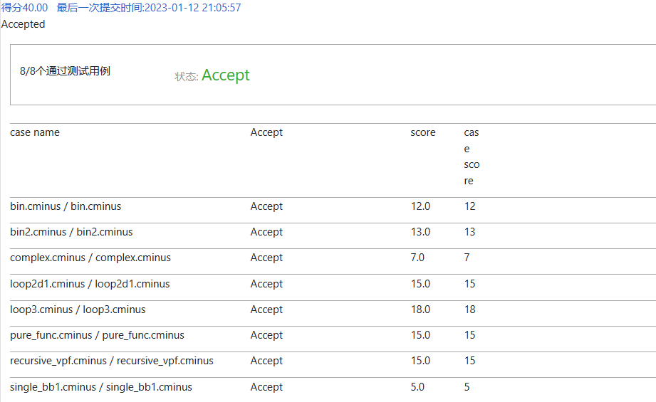
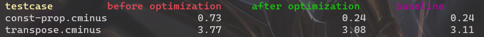
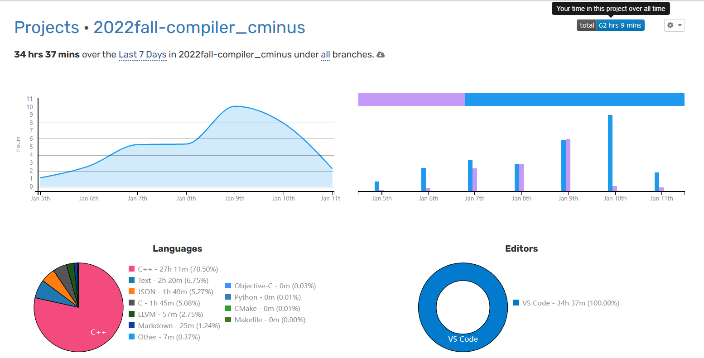

# Lab4.2 实验报告

李远航 PB2000137

## 实验要求

在 SSA IR 基础上，实现一个基于数据流分析的冗余消除的优化 Pass : Global Value Numbering（全局值编号）

## 实验难点

- 对`c++`的智能指针，虚函数等概念理解不透彻
- 理解并翻译伪代码的过程存在困难
- 调试的过程存在困难，由于层层嵌套的结构，调试时观察变量的值并不方便

## 实验设计

- `detectEquivalences()`

    - 先将全局变量加入等价类
    - 其次加入函数的形参
    - 根据每一个bb块前驱的数量，更新当前bb块的`pin_`
    - 依次遍历函数的每一个bb块，对每一条指令调用`transferFunction`
    - 遍历当前bb块的后续块中的`phi`指令，完成`copy statement`

    ```c++
    // 简略给出
    void GVN::detectEquivalences()
    {
        bool changed = false;
        // initialize pout with top
        // iterate until converge
        auto entry = func_->get_entry_block();
        pin_[entry] = {};
        auto p = clone(pin_[entry]);
        auto &args_var = func_->get_args();
    	// add args
        auto &globalvar = m_->get_global_variable();
    	// add global value
        for (auto &instr : entry->get_instructions())
            if (!instr.is_void())
                p = transferFunction(&instr, &instr, p);
    
        auto bb_ne = entry->get_succ_basic_blocks();
        if (bb_ne.size() != 0)
        {// copy statement for entry block
        }
        pout_[entry] = std::move(p);
        for (auto &bb : func_->get_basic_blocks())
        {//赋初值 Top
        }
        do
        {
            changed = false;
            for (auto &bb : func_->get_basic_blocks())
            {
                now_bb = &bb;
                if (&bb == entry)
                    continue;
                if (bb.get_pre_basic_blocks().size() >= 2)
                	//join
                else
                	//clone
    
                auto p = clone(pin_[&bb]);
                for (auto &instr : bb.get_instructions())
                    if (!instr.is_void())
                        p = transferFunction(&instr, &instr, p);
                
                // copy statement
                auto bb_ne = bb.get_succ_basic_blocks();
    
                //判断变化
                if (p != pout_[&bb])
                    changed = true;
                pout_[&bb] = std::move(p);
            }
        } while (changed);
    }
    ```

- `transferFunction()`

    -  依次调用`valueExpr()`和`valuePhiFunc()`
    - 先在已有的等价类中寻找是否存在`ve`或者`vpf`等价的项，如果有则加入
    - 否则，为当前的指令的左值新建一个等价类

    ```c++
    GVN::partitions GVN::transferFunction(Instruction *x, Value *e, partitions pin)
    {
        partitions pout = clone(pin);
    	//remove 
        
        auto ve = valueExpr(dynamic_cast<Instruction *>(x), pin);
        auto vpf = valuePhiFunc(ve, pin);
        bool flag = true;
    	//寻找是否有等价
    
        if (flag)
        {
            // 新建等价类
            auto cc = createCongruenceClass(next_value_number_++);
            pout.insert(cc);
        }
        return pout;
    }
    ```

- `valueExpr()`

    - 具体指令分别具体分析（可能过度讨论了？）
    - 在获得指令的操作数后，先在已有的等价类中寻找，如果找到相应的操作数，则将该操作数替换成与该等价类对应的`ve`或者`vpf`，否则，新建一个`VarExpression`（会在后续介绍）
    - 对于常量操作数，先通过`dynamic_cast`判断是否为常数，是则搜索等价或者新建一个`ConstantExpression`

- `valuePhiFunc()`

    - 先判断传入的值表达式是否为`PhiExpression`作二元运算的形式
    - 是则取操作数，生成新的`BinaryExpression`，并完成常量折叠，去前驱块中寻找是否出现过
    - 返回空或者新的`PhiExpression`

- `join()`和`insersect()`

    - 先特判`Top`的情况
    - 取交集，如果出现`index_`为0的情况，由于`copy statement`的存在，说明出现了`PhiExpression`

- `Expression`的额外设计

    - 加入了变量表达式，调用表达式，取数组元素表达式，比较表达式，单变量运算表达式
    - 增加虚函数，获取表达式的左右操作数

- 常量折叠的设计

    - 遇到常量时，先判断是否为常量，接着建立`ConstantExpression`

- 纯函数的设计

    - 使用`CallExpression`标记等价类
    - 先判断是否为纯函数
    - 将调用参数传入`CallExpression`

    ```c++
    else if (instr->is_call())
    {
        auto op = instr->get_operands();
        auto thisfunction = dynamic_cast<Function *>(op[0]);
        if (!func_info_->is_pure_function(thisfunction))
            return VarExpression::create(instr->get_name());
        else
        {
            std::vector<std::shared_ptr<Expression>> args;
            for (auto it : op)
            {
                //寻找参数是否在等价类中存在
                args.push_back(ep);
            }
            return CallExpression::create(thisfunction, args);
        }
    }
    ```

- 具体的代码可以见文件

    - ~~东打一个补丁，西打一个补丁~~

- 优化分析

    - 优化前`IR`

        ```assembly
        declare i32 @input()
        
        declare void @output(i32)
        
        declare void @outputFloat(float)
        
        declare void @neg_idx_except()
        
        define i32 @main() {
        label_entry:
          %op0 = call i32 @input()
          %op1 = call i32 @input()
          %op2 = icmp sgt i32 %op0, %op1
          %op3 = zext i1 %op2 to i32
          %op4 = icmp ne i32 %op3, 0
          br i1 %op4, label %label5, label %label14
        label5:                                                ; preds = %label_entry
          %op6 = add i32 33, 33
          %op7 = add i32 44, 44
          %op8 = add i32 %op6, %op7
          br label %label9
        label9:                                                ; preds = %label5, %label14
          %op10 = phi i32 [ %op8, %label5 ], [ %op17, %label14 ]
          %op11 = phi i32 [ %op7, %label5 ], [ %op16, %label14 ]
          %op12 = phi i32 [ %op6, %label5 ], [ %op15, %label14 ]
          call void @output(i32 %op10)
          %op13 = add i32 %op12, %op11
          call void @output(i32 %op13)
          ret i32 0
        label14:                                                ; preds = %label_entry
          %op15 = add i32 55, 55
          %op16 = add i32 66, 66
          %op17 = add i32 %op15, %op16
          br label %label9
        }
        ```

    - 优化后`IR`

        ```assembly
        declare i32 @input()
        
        declare void @output(i32)
        
        declare void @outputFloat(float)
        
        declare void @neg_idx_except()
        
        define i32 @main() {
        label_entry:
          %op0 = call i32 @input()
          %op1 = call i32 @input()
          %op2 = icmp sgt i32 %op0, %op1
          %op3 = zext i1 %op2 to i32
          %op4 = icmp ne i32 %op3, 0
          br i1 %op4, label %label5, label %label14
        label5:                                                ; preds = %label_entry
          br label %label9
        label9:                                                ; preds = %label5, %label14
          %op10 = phi i32 [ 154, %label5 ], [ 242, %label14 ]
          call void @output(i32 %op10)
          call void @output(i32 %op10)
          ret i32 0
        label14:                                                ; preds = %label_entry
          br label %label9
        }
        ```

    - 可以看到在上述的优化后，常量相加计算的部分被编译器直接计算，又因为`%op8`，`%op13`，`%op17`的运算等价，冗余指令被删除，上述的例子可以看到，基本实现了编译优化的功能

- 效果展示

    

    

### 思考题

1. 请简要分析你的算法复杂度

    每一遍循环，会遍历每一条指令， 对于每条指令的`ve`，会在等价类中查找数次，复杂度和等价类内的数目是同一数量级的，`vpf`指令最多只会向上搜寻所有的`block`，调用`join`时，复杂度为两个partition元素个数的乘积，总的循环次数的和等价类数大致相同，最后复杂度大约是$O(等价类数^3\times 等价类内元素数\times调用join的次数)$

2. `std::shared_ptr`如果存在环形引用，则无法正确释放内存，你的 Expression 类是否存在 circular reference?

    不存在，如果存在环形引用的值表达式，LOG输出调试信息的输出会无法结束，但是没有出现这种情况

3. 尽管本次实验已经写了很多代码，但是在算法上和工程上仍然可以对 GVN 进行改进，请简述你的 GVN 实现可以改进的地方

    - 在处理phi函数寻找等价类的时候，需要遍历等价类，带来了很多不必要的计算，我认为可以第一遍优化先完成冗余指令的删除，常量折叠等等，再第二遍优化处理phi函数
    - 可以改进block访问的顺序，来减少到等价类收敛所需要的循环次数

## 实验总结

- 对`c++`能力有极大的提升
- 提升了对`gvn`算法，编译优化的理解
- 提升了调试代码的能力

## 实验反馈（可选 不会评分）

- 大概是我太菜了吧，最后一次实验用时和原来所有的加起来差不多
- 感觉实验的主要时间都花在犹豫要不要改整体结构，包括函数传递，返回的参数等等，如果一开始就可以决定根据自己需要改参数，应该会节省很多时间
- 1月5日过正式开始研究，1个小时破防，1月6日过了`singlebb`，1月7日，1月8日花两天过了`bin`，但此时没有用`copy statement`，1月9日花一天时间过了`loop`感觉理解`gvn`了，1月10日最后一天常量折叠，纯函数，其他指令写起来就非常快，基本没怎么调试，1月11日实验报告。
- 1月9日调`loop3`的时候可以看到，`Debugging`的时间比`Coding`的时间长，段错误太可怕了



